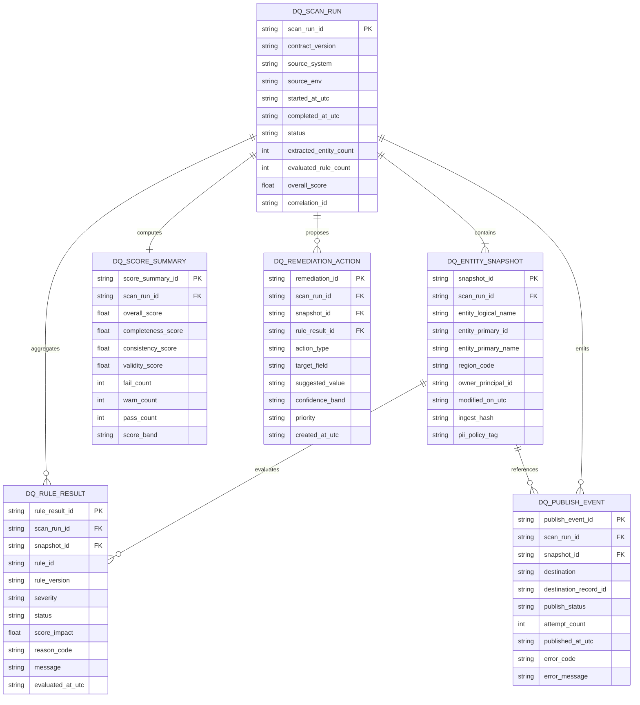

# CRM Data Quality ER Diagram (Eng-5)

## Scope and contract version
- Canonical schema contract family: `crm-dq-canonical`
- Versioning model: `vMAJOR.MINOR` (per ADR-005)
- Initial target: `v1.0`
- Interface alignment: entities support Eng-2 operations `extract`, `score`, and `publish` (ADR-002)

## Diagram

## Cardinality and lifecycle notes
- One `DQ_SCAN_RUN` contains many `DQ_ENTITY_SNAPSHOT` rows.
- One `DQ_ENTITY_SNAPSHOT` can produce zero-to-many `DQ_RULE_RESULT` rows.
- One `DQ_SCAN_RUN` has one `DQ_SCORE_SUMMARY` row.
- `DQ_REMEDIATION_ACTION` is optional and only present for failed/warn rule outcomes.
- `DQ_PUBLISH_EVENT` is append-only for auditability; retries create new attempts on same `publish_event_id` record or append events depending on persistence mode (implementation decision in Eng-2 publish path).

## Entity role by Eng-2 operation
- `extract`: produces `DQ_SCAN_RUN` + `DQ_ENTITY_SNAPSHOT`.
- `score`: consumes snapshots, emits `DQ_RULE_RESULT` + `DQ_SCORE_SUMMARY` + optional `DQ_REMEDIATION_ACTION`.
- `publish`: writes `DQ_PUBLISH_EVENT` and destination ids/statuses.

## Adapter payload mapping notes
- `ExtractRequest.entity` / `ExtractResult.entity` map to `DQ_ENTITY_SNAPSHOT.entity_logical_name`.
- `CanonicalRecord.id` maps to `DQ_ENTITY_SNAPSHOT.entity_primary_id`; `CanonicalRecord.name` maps to `entity_primary_name`.
- `ScoreItem.recordId` is currently the join key for `DQ_RULE_RESULT.snapshot_id` until explicit `snapshot_id` propagation is added.
- `ScoreResult.averageScore` maps to `DQ_SCORE_SUMMARY.overall_score`; sub-scores and `score_band` are canonical-only until parity expansion.
- `PublishRequest.remediationRunId` maps to `DQ_SCAN_RUN.scan_run_id`; `PublishResult.status` maps to `DQ_PUBLISH_EVENT.publish_status` with enum expansion required for canonical parity.

## Validation anchors for QA design
- Every row except `DQ_PUBLISH_EVENT` must carry `scan_run_id`.
- `contract_version` must be present and semver-prefixed (`v`).
- `DQ_SCORE_SUMMARY.overall_score` must be derivable from rule outcomes.
- `DQ_RULE_RESULT` must be immutable once published in a completed run.

## Dataverse metadata confirmation required
- `entity_primary_name`, `owner_principal_id`, and `region_code` mapping requires tenant metadata confirmation.
- Destination write-back field names for `DQ_PUBLISH_EVENT.destination_record_id` depend on Dataverse table configuration.
- `opportunity` enablement in the adapter entity union must be confirmed against tenant table exposure before production cutover.
